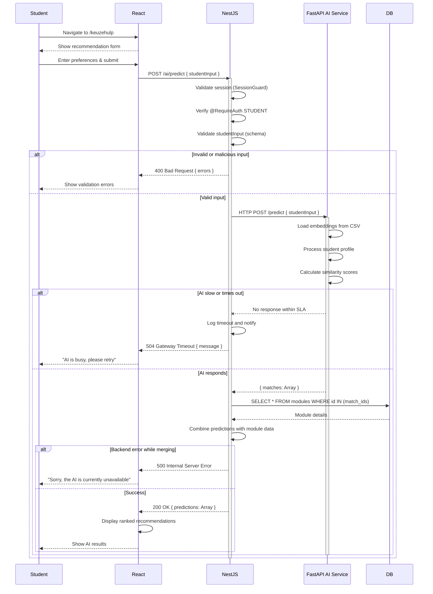
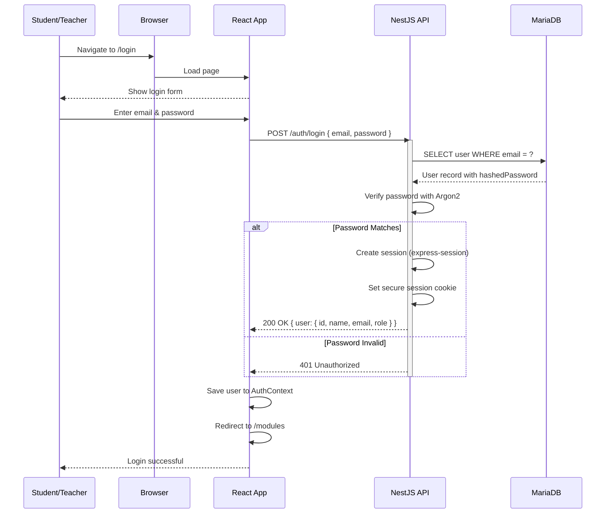
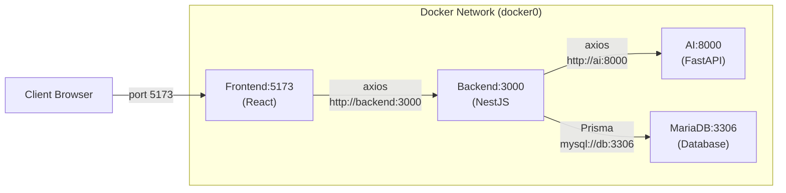

## Get AI Recommendations

```mermaid
sequenceDiagram
    participant Student
    participant Frontend as React
    participant Backend as NestJS
    participant AI as FastAPI AI Service
    participant DB

    Student->>Frontend: Navigate to /keuzehulp
    Frontend-->>Student: Show recommendation form

    Student->>Frontend: Enter preferences & submit
    Frontend->>Backend: POST /ai/predict { studentInput }

    activate Backend
    Backend->>Backend: Validate session (SessionGuard)
    Backend->>Backend: Verify @RequireAuth STUDENT
    Backend->>Backend: Validate studentInput (schema)

    alt Invalid or malicious input
        Backend-->>Frontend: 400 Bad Request { errors }
        Frontend-->>Student: Show validation errors
    else Valid input
        Backend->>AI: HTTP POST /predict { studentInput }

        activate AI
        AI->>AI: Load embeddings from CSV
        AI->>AI: Process student profile
        AI->>AI: Calculate similarity scores

        alt AI slow or times out
            AI--xBackend: No response within SLA
            Backend->>Backend: Log timeout and notify
            Backend-->>Frontend: 504 Gateway Timeout { message }
            Frontend-->>Student: "AI is busy, please retry"
        else AI responds
            AI-->>Backend: { matches: Array }

            Backend->>DB: SELECT * FROM modules WHERE id IN (match_ids)
            DB-->>Backend: Module details

            Backend->>Backend: Combine predictions with module data
            alt Backend error while merging
                Backend-->>Frontend: 500 Internal Server Error
                Frontend-->>Student: "Sorry, the AI is currently unavailable"
            else Success
                Backend-->>Frontend: 200 OK { predictions: Array }

                Frontend->>Frontend: Display ranked recommendations
                Frontend-->>Student: Show AI results
            end
        end
        deactivate AI
    end
    deactivate Backend
```

## Login Flow

```mermaid
sequenceDiagram
    participant User as Student/Teacher
    participant Browser as Browser
    participant Frontend as React App
    participant Backend as NestJS API
    participant DB as MariaDB

    User->>Browser: Navigate to /login
    Browser->>Frontend: Load page
    Frontend-->>User: Show login form

    User->>Frontend: Enter email & password
    Frontend->>Backend: POST /auth/login { email, password }

    activate Backend
    Backend->>DB: SELECT user WHERE email = ?
    DB-->>Backend: User record with hashedPassword
    Backend->>Backend: Verify password with Argon2

    alt Password Matches
        Backend->>Backend: Create session (express-session)
        Backend->>Backend: Set secure session cookie
        Backend-->>Frontend: 200 OK { user: { id, name, email, role } }
    else Password Invalid
        Backend-->>Frontend: 401 Unauthorized
    end
    deactivate Backend

    Frontend->>Frontend: Save user to AuthContext
    Frontend->>Frontend: Redirect to /modules
    Frontend-->>User: Login successful
```

# # Physical Architecture (Docker Compose)

```mermaid
graph LR
Client["Client Browser"]

    subgraph "Docker Network (docker0)"
        Frontend["Frontend:5173<br/>(React)"]
        Backend["Backend:3000<br/>(NestJS"]
        AI["AI:8000<br/>(FastAPI)"]
        DB["MariaDB:3306<br/>(Database)"]

        Frontend -->|axios<br/>http://backend:3000| Backend
        Backend -->|axios<br/>http://ai:8000| AI
        Backend -->|Prisma<br/>mysql://db:3306| DB

    end

    Client -->|port 5173| Frontend
```
